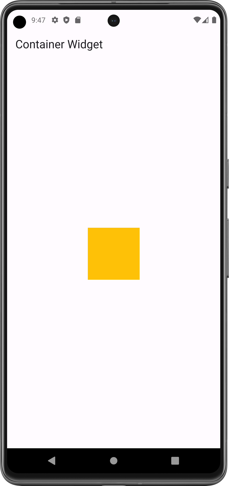

# Container Widget

It is a widget that combines common painting, positioning and sizing of child widgets.

- [Resource(flutter.dev)](https://api.flutter.dev/flutter/widgets/Container-class.html)

## Properties:
   - height: int/float/double
   - width: int/float/double
   - color: Colors.any_color   (color of container/background color of child)
   - child: any_widget
   - margin: EdgeInsets.only/all   (space outside the container)
   - padding: EdgeInsets.only/all   (space inside the container)
   - alignment: Alignment.center/topRight/(x,y)   (Align the child within the container.)
   - transform: Matrix4.rotationX/Y/Z(float)   (rotate the container)
   - decoration: BoxDecoration(border/shadow/shape)

#### Flutter App Screenshots

<table>
  <tr>
    <td>Simple Container</td>
     <td>Center Container</td>
     <td>Rotated Container</td>
  </tr>
  <tr>
    <td></td>
    <td></td>
    <td></td>
  </tr>
 </table>
