# Column Widget

A widget that displays its children widgets vertically.

- [Resource(flutter.dev)](https://api.flutter.dev/flutter/widgets/Column-class.html)

The Column widget does not scrollable.

To cause a child to expand to fill the available vertical space, wrap the child in an Expanded widget.

## Properties:
   - children: [] Contain same type or different type of widgets as children
   - mainAxisAlignment: vertical alignment
   - crossAxisAlignment: horizontal alignment

##### Define Type of children widgets:

- children: <Widget_name> [] 
- It allows only same type of widgets as children. no other type of widget allow as children.
- Note: Recommend to not mention type of widget, So you can take any type of widget as children.

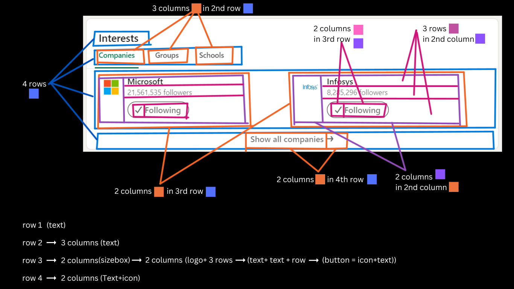

#### Flutter App Screenshots

<table>
  <tr>
    <td>Column of Container</td>
     <td>Column of Text</td>
     <td>Column of Button</td>
  </tr>
  <tr>
    <td>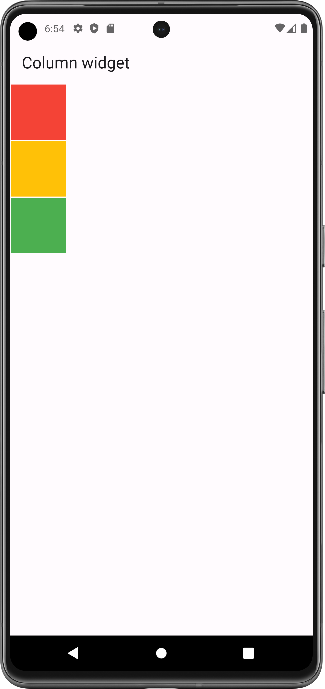</td>
    <td>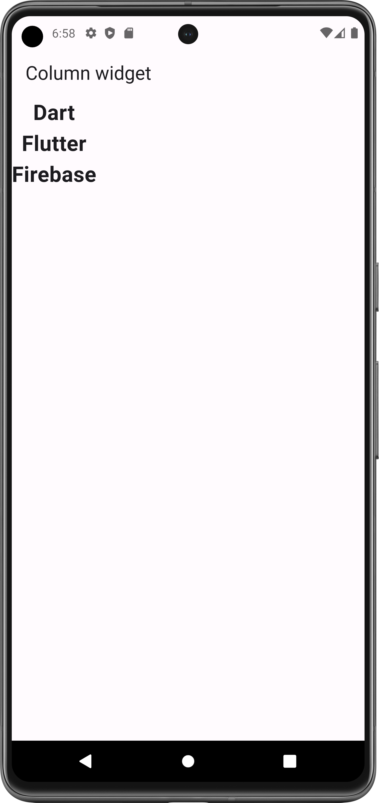</td>
    <td></td>
    
  </tr>
 </table>

## Main Axis Alignment:

Main Axis for Column: Vertical Line

- mainAxisAlignment
  - spaceEvenly (space between each widget same)
  - spaceBetween (both end space = space between/2)
  - spaceAround (both end no space)
  - start 
  - center (center of height)
  - end

#### Flutter App Screenshots

<table>
  <tr>
    <td>spaceEvenly</td>
     <td>spaceAround</td>
     <td>spaceBetween</td>
  </tr>
  <tr>
    <td>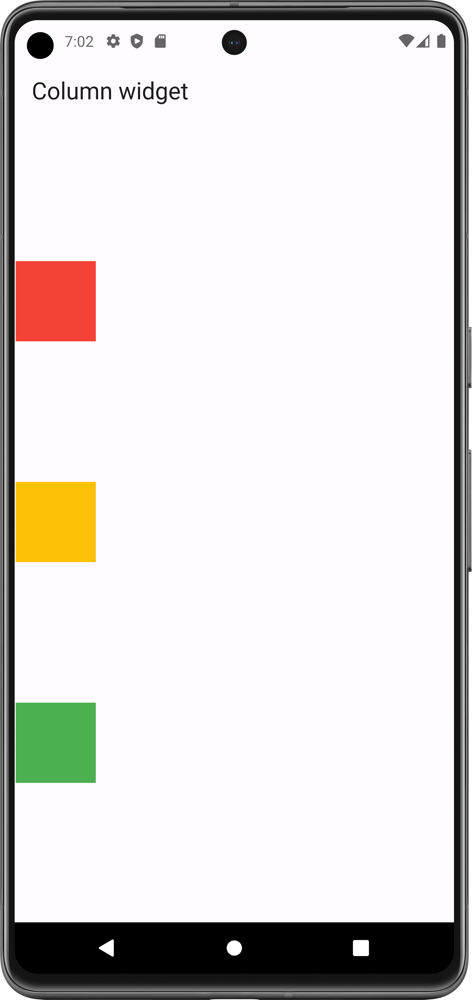</td>
    <td>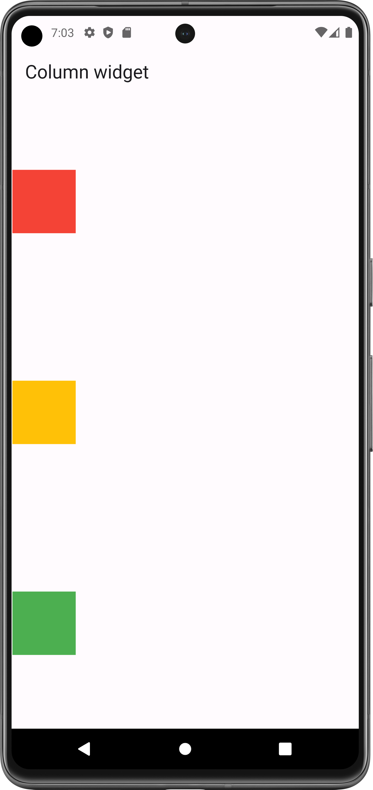</td>
    <td>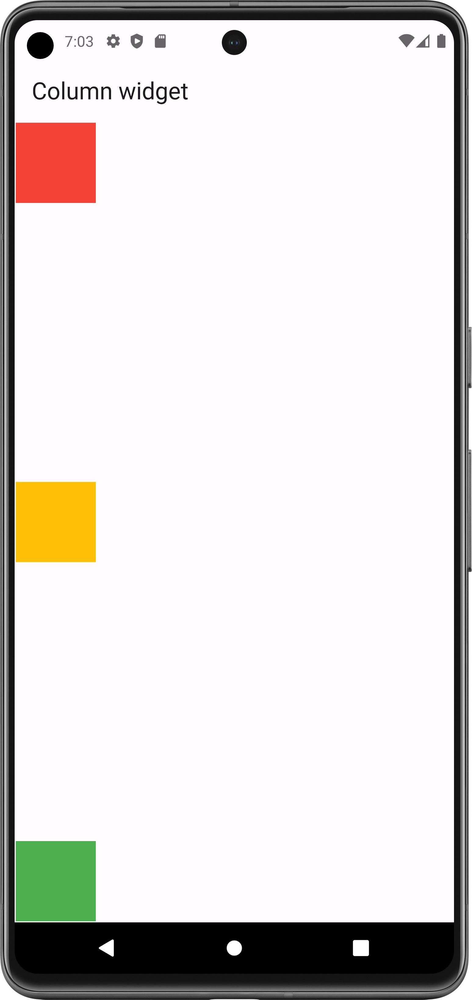</td>

  </tr>
 </table>

<table>
  <tr>
    <td>start</td>
     <td>center</td>
     <td>end</td>
  </tr>
  <tr>
    <td></td>
    <td>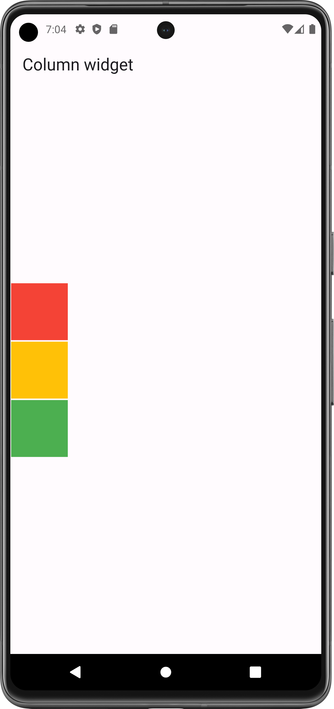</td>
    <td>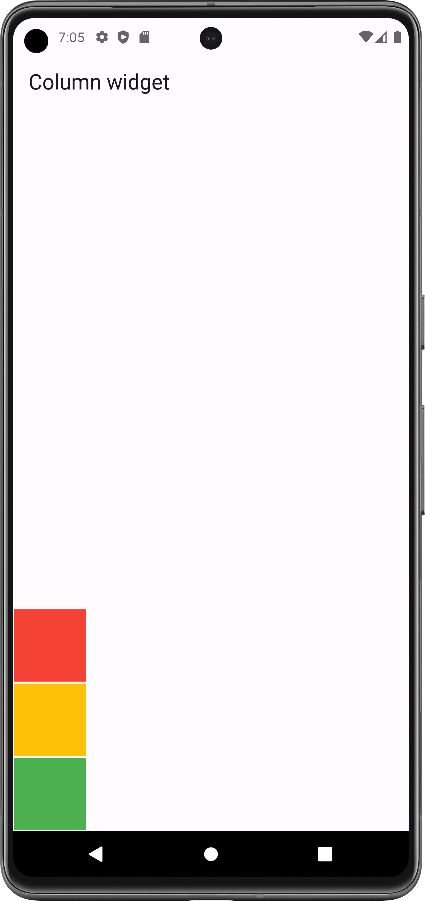</td>

  </tr>
 </table>

## Cross Axis Alignment:

Cross Axis for Column: Horizontal Line

- crossAxisAlignment
    - start
    - center (center of width)
    - end
    - stretch
    - baseline

- Note: by default width of row = width of its children widget.

So to align Column on cross axis, you must need to provide width by wrap row with Container or Sizebox.

#### Flutter App Screenshots

<table>
  <tr>
    <td>Cross Axis Center</td>
     <td>Cross Axis end</td>
     <td>Stretch</td>
  </tr>
  <tr>
    <td>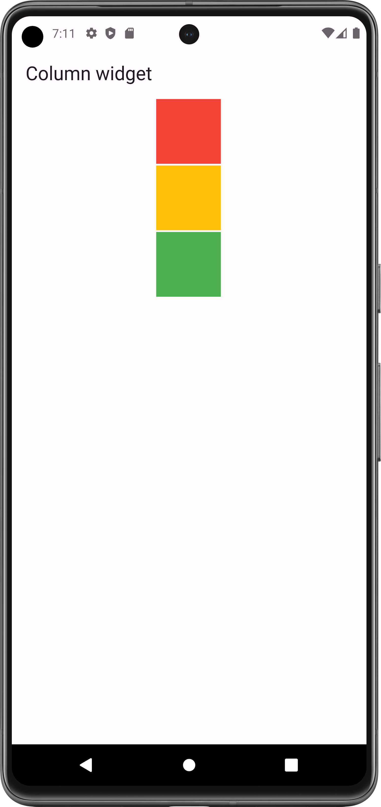</td>
    <td>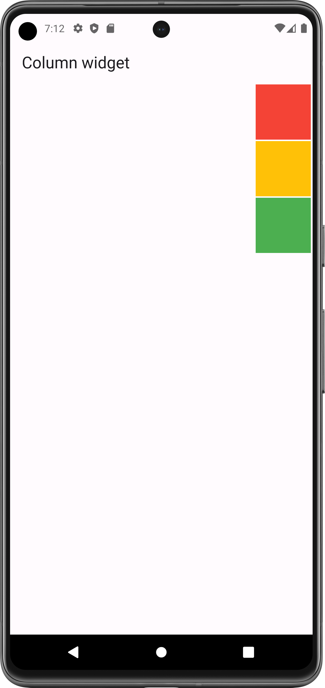</td>
    <td>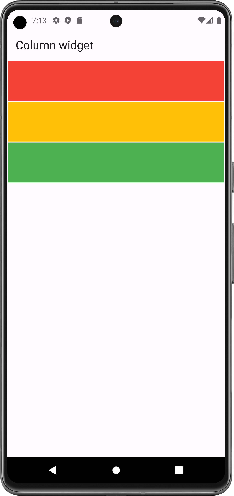</td>

  </tr>
 </table>

## Column wrapped with Container:

Used to fix height and width of Row.

It align its children in area of Container.

#### Flutter App Screenshots

<table>
  <tr>
    <td>spaceEvenly</td>
     <td>spaceBetween</td>
     <td>center</td>
     <td>bottom end</td>
  </tr>
  <tr>
    <td></td>
    <td>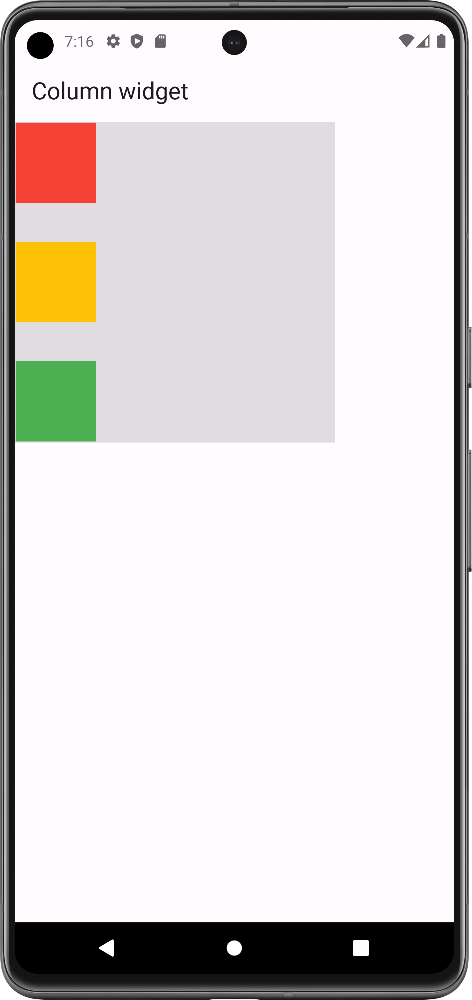</td>
    <td>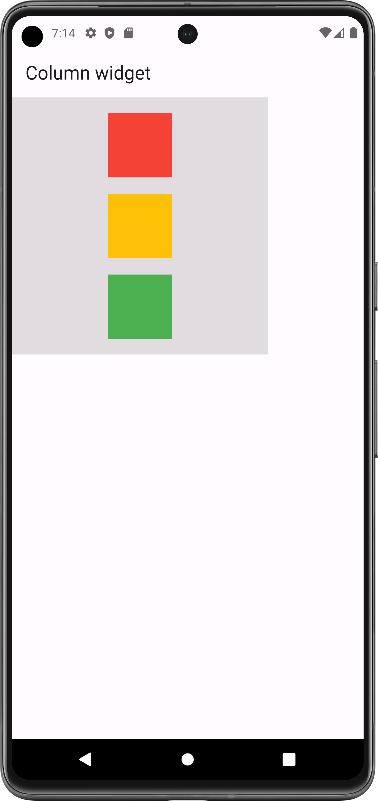</td>
    <td>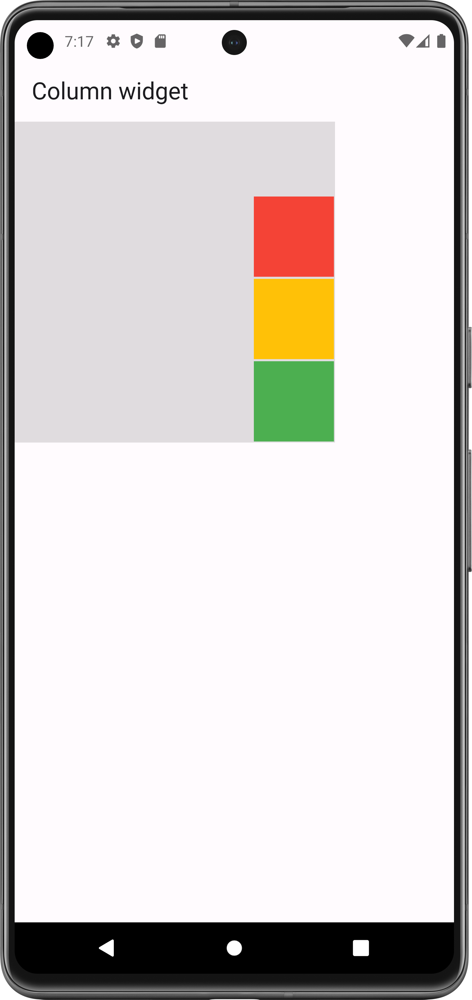</td>

  </tr>
 </table>
