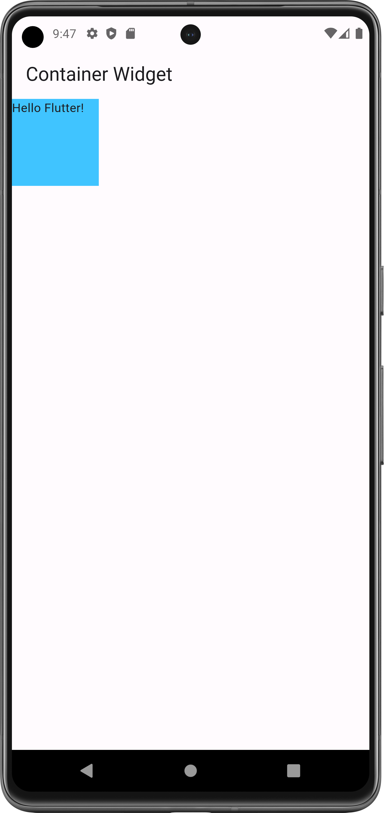
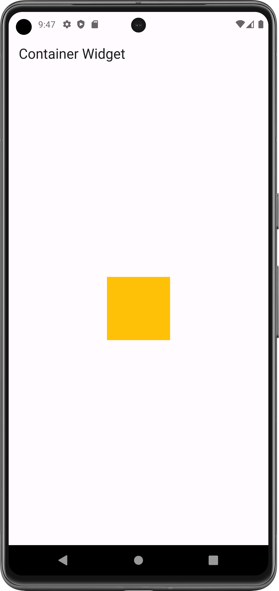
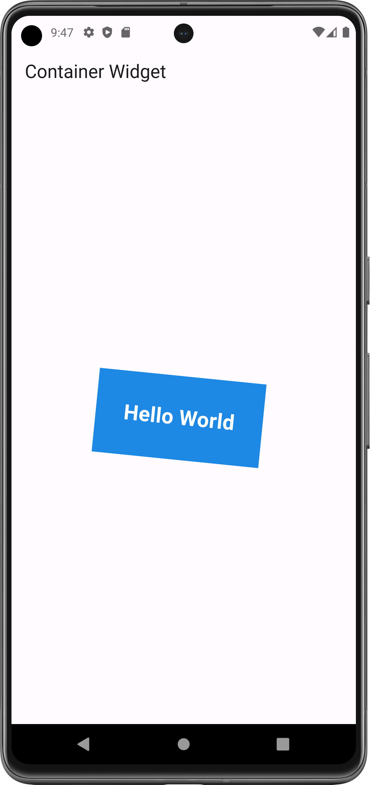

# Container Widget

- [Resource](https://api.flutter.dev/flutter/widgets/Container-class.html)

#### Flutter App Screenshots

<table>
  <tr>
    <td>Simple Container</td>
     <td>Center Container</td>
     <td>Rotated Container</td>
  </tr>
  <tr>
    <td></td>
    <td></td>
    <td></td>
  </tr>
 </table>
