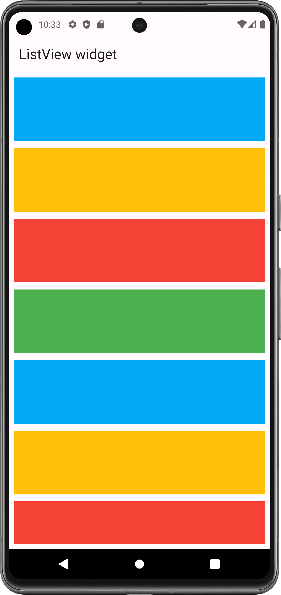

# ListView Widget

A scrollable list of widgets arranged in linear manner.

Used to make scrollable list of text, image, container etc...

- ListView: used for (static data), So size of list will not change at RunTime.
- ListView.builder: used for (Dynamic data), Size of list will be changed at RunTime
- ListView.separated: used to separate children by using divider (for dynamic data)

- [Resource(flutter.dev)](https://api.flutter.dev/flutter/widgets/ListView-class.html)

## Properties:
   - children: [] list of widget (widget that you want make scrollable)
   - scrollDirection: Axis.(horizontal, vertical)
     - when scroll direction is vertical: it arrange children one by one from top -> bottom.
     - when scroll direction is horizontal: it arrange children one by one from left -> right.
 

#### ListView Scrolling :

<table>
  <tr>
    <td>List of Container</td>
     <td>list of vertical images</td>
     <td>Horizontal & vertical list</td>
  </tr>
  <tr>
    <td><video src="https://github.com/Jaydip614/Flutter-Development-3.0/assets/148715011/cea9aff0-3b78-4614-9376-f4409337207f
" width=200 height=416></video></td>
    <td><video src="https://github.com/Jaydip614/Flutter-Development-3.0/assets/148715011/0696f177-a025-4d4c-916b-0e9132823dcc" width=200 height=416></video></td>
    <td><video src="https://github.com/Jaydip614/Flutter-Development-3.0/assets/148715011/c407b4f9-587d-4066-b51c-517a553c488d" width=200 height=416></video></td>
   
  </tr>
 </table>

### Flutter App Snapshot:

- Note:
  - In horizontal scroll direction, you must need to provide width to children.
  - by wrapping children with Sizebox you can provide width.
  - Also for better layout, wrap your ListView with Sizebox and provide appropriate height.

<table>
  <tr>
    <td>ListView of Container</td>
     <td>vertical image Listview</td>
     <td>Horizontal & vertical list </td>
  </tr>
  <tr>
    <td></td>
    <td></td>
    <td></td>

  </tr>
 </table>
