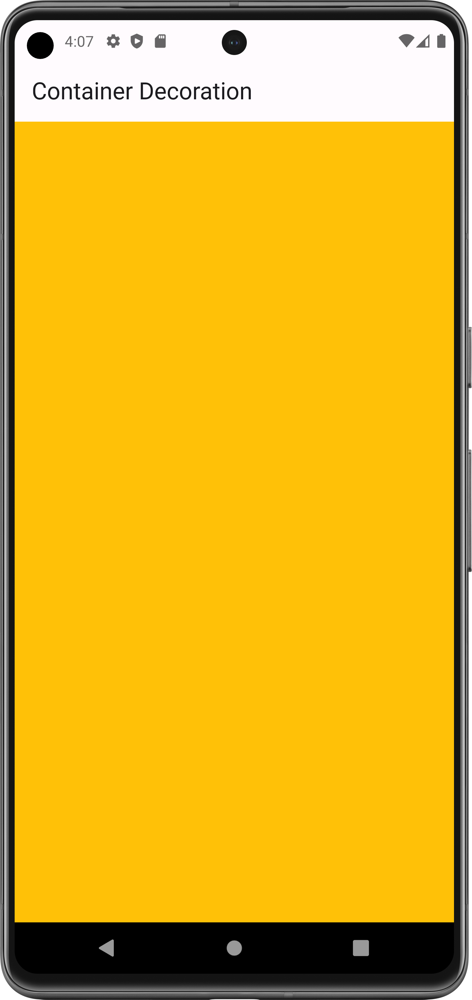
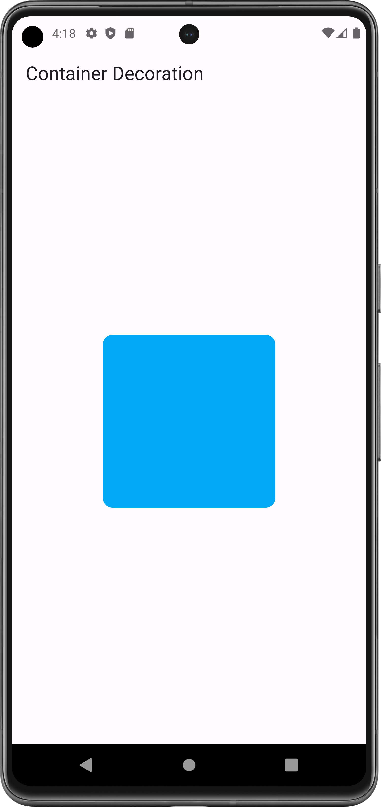
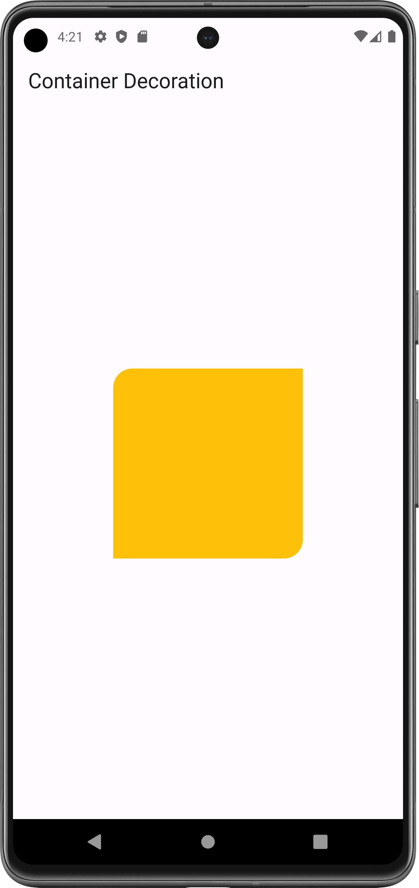
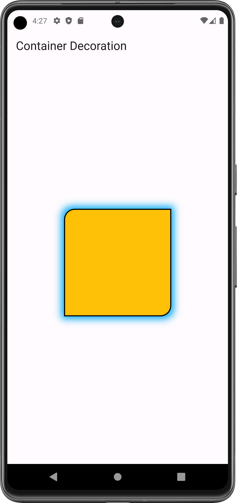
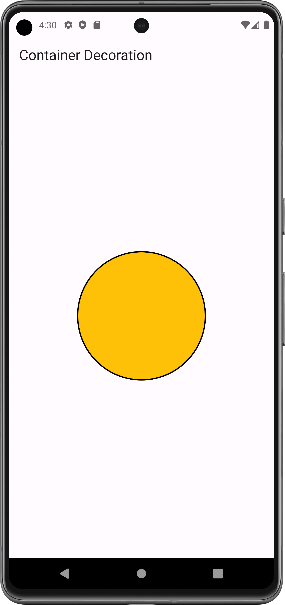

# BoxDecoration Widget: 

The BoxDecoration class provides a variety of ways to draw a box.

- [Resource(flutter.dev)](https://api.flutter.dev/flutter/widgets/BoxDecoration-class.html)

## Properties:
   - color: to provide color
   - borderRadius: BorderRadius.circle/only (round the corner)
   - border: Border.all (to provide width and color of border)
   - boxShadow: [] BoxShadow: to provide shadow
   - shape: to provide shape of box
   - image: to add image in container

### Flutter App Snapshot:

<table>
  <tr>
    <td>full size Container</td>
     <td>BorderRadius Circular</td>
     <td>BorderRadius only</td>
  </tr>
  <tr>
    <td></td>
    <td></td>
    <td></td>

  </tr>
 </table>

<table>
  <tr>
    <td>black border</td>
     <td>Box Shadow</td>
     <td>Box Shape</td>
  </tr>
  <tr>
    <td></td>
    <td></td>
    <td></td>

  </tr>
 </table>
