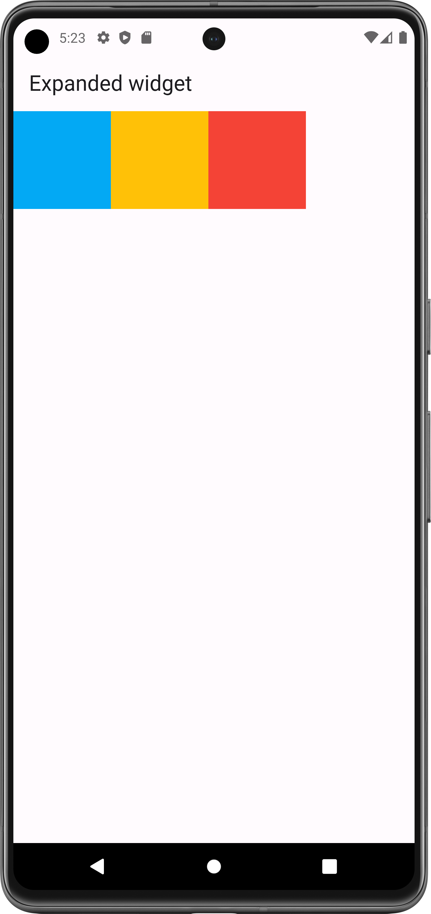
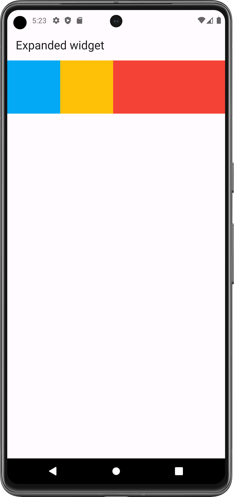
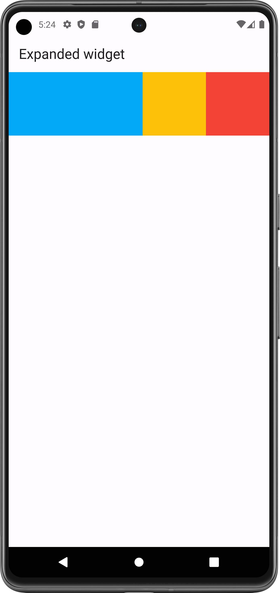
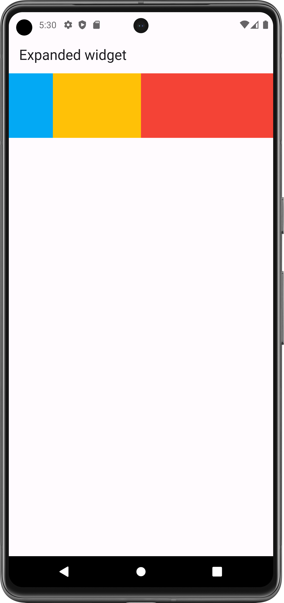
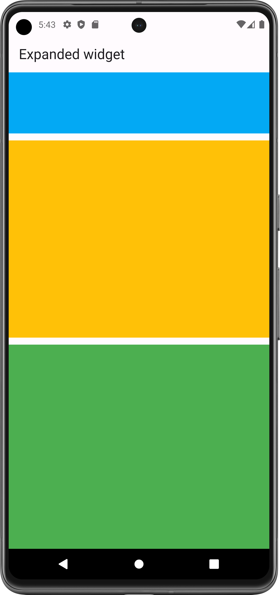
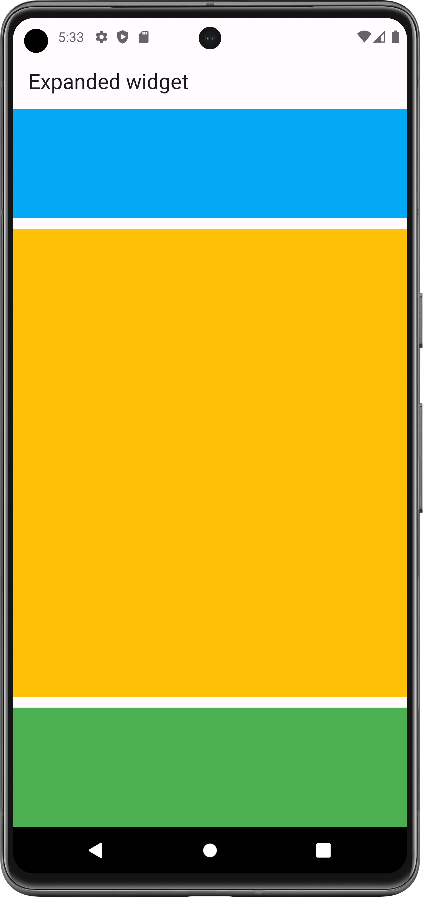

# Expanded Widget: 

A widget that expands a child of a Row, Column, or Flex so that the child fills the available space.

- [Resource(flutter.dev)](https://api.flutter.dev/flutter/widgets/Expanded-class.html)

## Properties:
   - flex: to provide ratio of expand

### Flutter App Snapshot:

<table>
  <tr>
    <td>Without expanded</td>
     <td>Expanded red</td>
     <td>Expanded blue</td>
  </tr>
  <tr>
    <td></td>
    <td></td>
    <td></td>

  </tr>
 </table>

<table>
  <tr>
    <td>Expanded with flex</td>
     <td>Expanded Column</td>
     <td>Expanded Column</td>
  </tr>
  <tr>
    <td></td>
    <td></td>
    <td></td>

  </tr>
 </table>
