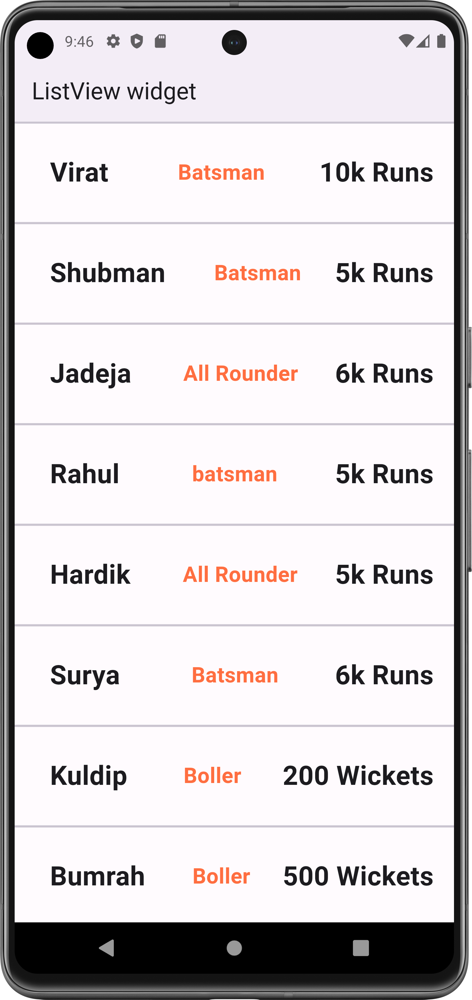

# ListView.separated Widget

A scrollable list of widgets arranged in linear manner.

Used to make scrollable list of text, image, container etc...

- ListView: used for (static data), So size of list will not change at RunTime.
- ListView.builder: used for (Dynamic data), Size of list will be changed at RunTime
- ListView.separated: used to separate children by using divider (for dynamic data)

- [Resource(flutter.dev)](https://api.flutter.dev/flutter/widgets/ListView-class.html)

## Properties:
   - children: [] list of widget (widget that you want make scrollable)
   - scrollDirection: Axis.(horizontal, vertical)
     - when scroll direction is vertical: it arrange children one by one from top -> bottom.
     - when scroll direction is horizontal: it arrange children one by one from left -> right.
   - separatedBuilder: (context, index)
     - Divider widget: *Properties: [height: ,thickness: ]

### Flutter App Snapshot:

- Note:
  - In horizontal scroll direction, you must need to provide width to children.
  - by wrapping children with Sizebox you can provide width.
  - Also for better layout, wrap your ListView with Sizebox and provide appropriate height.

<table>
  <tr>
    <td>listView separated</td>
     
  </tr>
  <tr>
    <td></td>

  </tr>
 </table>
