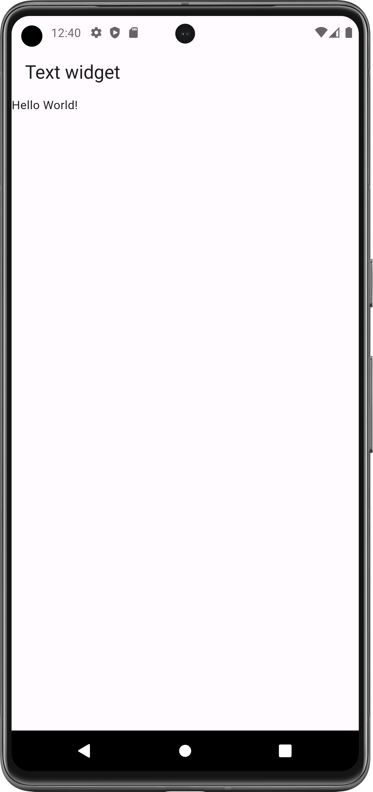
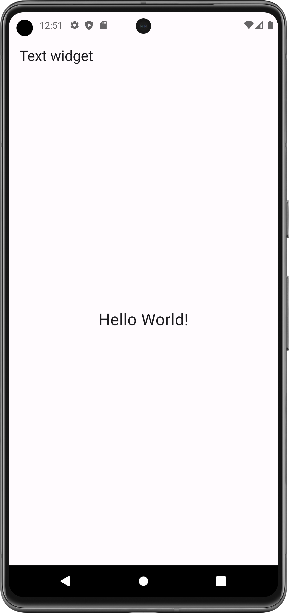
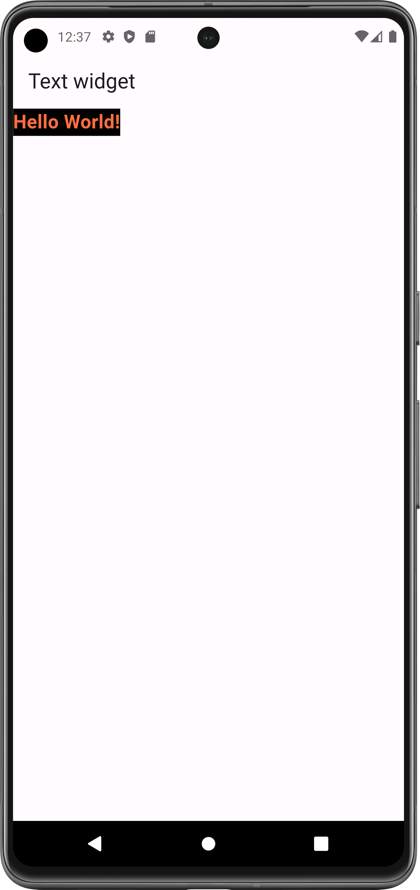

# Text Widget

The Text widget display a string of text with single style.

- [Resource(flutter.dev)](https://api.flutter.dev/flutter/widgets/Text-class.html)

## Properties:
- style: TextStyle()
  - color: Colors.any_color
  - fontSize: int/float
  - fontWeight: FontWeight.bold/w500
  - backgroundColor: Colors.any_color
- textAlign: TextAlign.center/right/left
- textDirection: TextDirection.ltr/rtl
          

#### Flutter App Screenshots

<table>
  <tr>
    <td>Simple Text</td>
     <td>Center Text</td>
     <td>Decorated Text</td>
  </tr>
  <tr>
    <td></td>
    <td></td>
    <td></td>
  </tr>
 </table>
