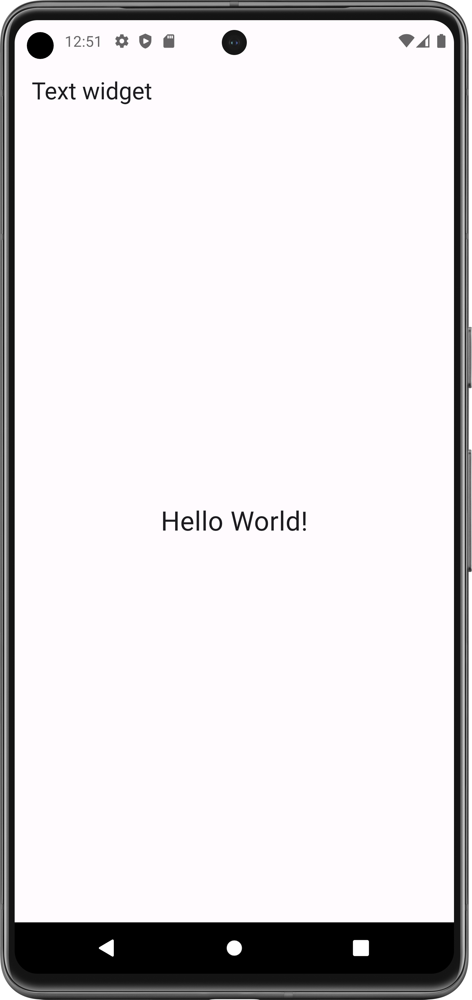

# Center Widget

A widget that centers its child within itself.

- [Resource(flutter.dev)](https://api.flutter.dev/flutter/widgets/Center-class.html)

## Properties:
- child: any_widget

#### Flutter App Screenshots

<table>
  <tr>
    <td>center Text</td>
     <td>Center Container</td>
     <td>Center in Center</td>
  </tr>
  <tr>
    <td></td>
    <td></td>
    <td></td>
  </tr>
 </table>
