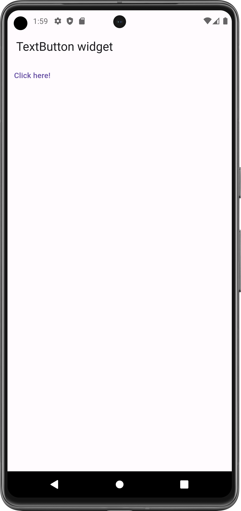
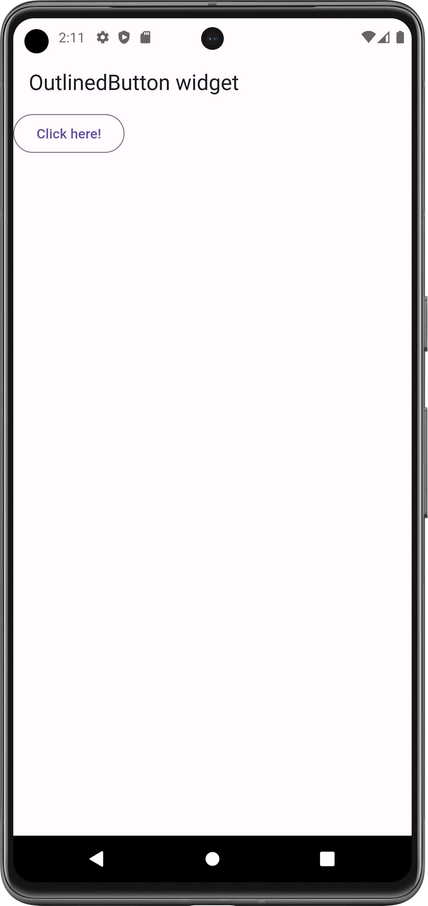
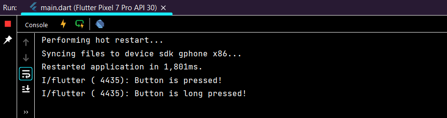

# Button Widget

- [Text Button](https://api.flutter.dev/flutter/material/TextButton-class.html)
- [Elevated Button](https://api.flutter.dev/flutter/material/ElevatedButton-class.html)
- [Outlined Button](https://api.flutter.dev/flutter/material/OutlinedButton-class.html)

## Properties:
- child: any_widget
- onPressed: 
- onLongPressed: 

#### Flutter App Screenshots

<table>
  <tr>
    <td>Text Button</td>
     <td>Elevated Button</td>
     <td>Outlined Button</td>
  </tr>
  <tr>
    <td></td>
    <td></td>
    <td></td>
  </tr>
 </table>

### Output:

