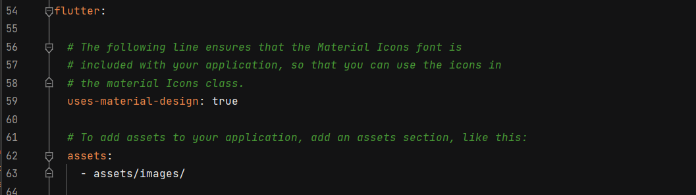
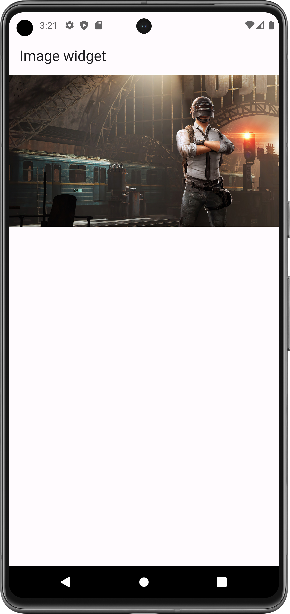
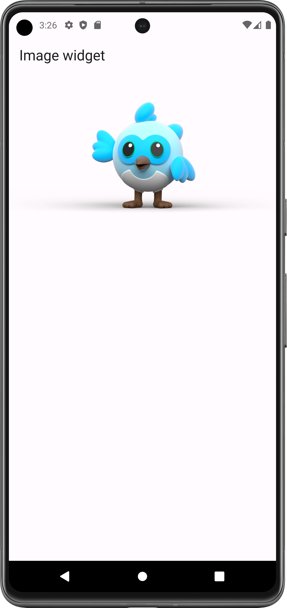
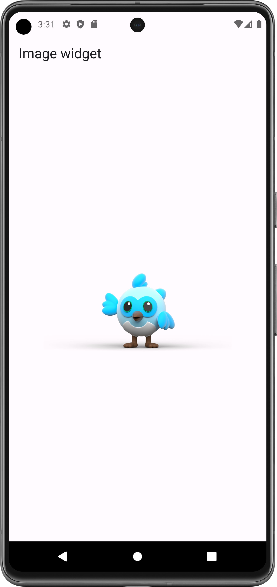

# Image Widget

A widget that displays an image.

- [Resource(flutter.dev)](https://api.flutter.dev/flutter/widgets/Image-class.html)

### Instruction to use image widget:

1- create a new Directoty/folder with Name: assets

2- Into assets Folder, create a new folder with Name: images

3- Go to your File manager

4- Copy your images and paste it into images Folder

##### Must update pubspec.yaml file:

5- Remove comment from asset

6- Give path of all images of image folder as shown as below with proper indentation:

   
7- After that Click on "pub get"

8- Click on "get dependencies" (if required?) 

#### Flutter App Screenshots

<table>
  <tr>
    <td>Simple Container</td>
     <td>Center Container</td>
     <td>Rotated Container</td>
  </tr>
  <tr>
    <td></td>
    <td></td>
    <td></td>
  </tr>
 </table>
