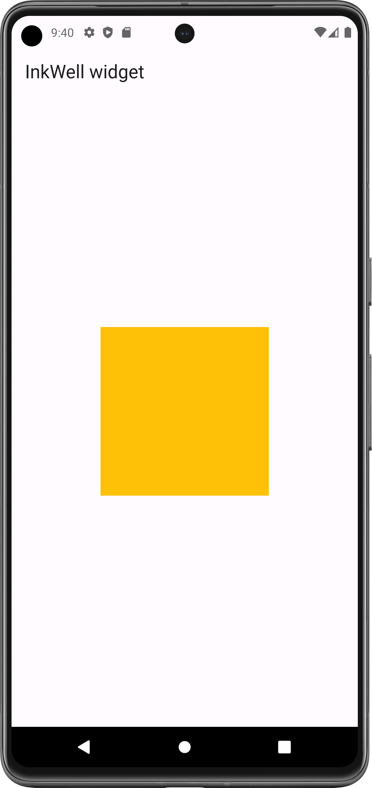
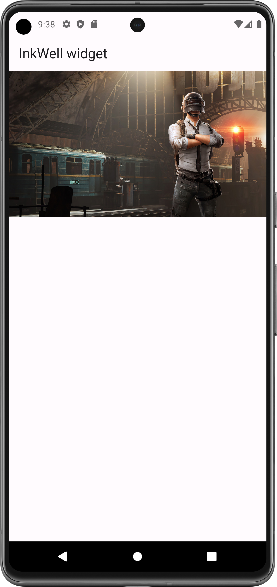
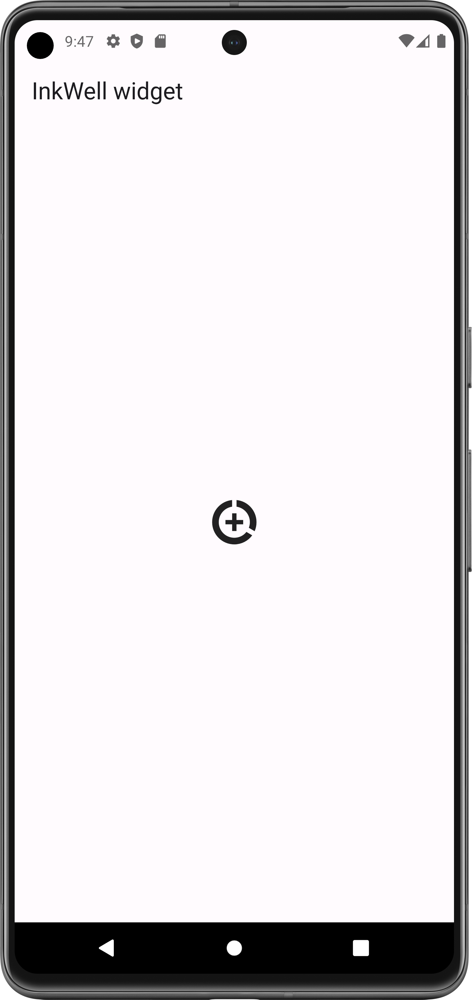
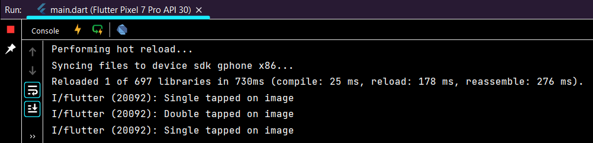
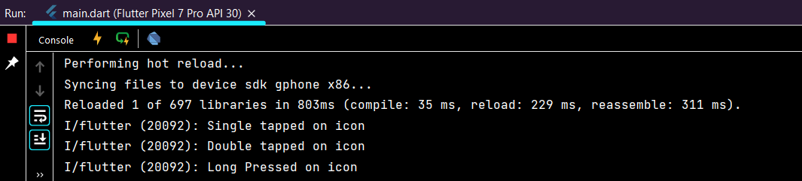

# Inkwell Widget

A rectangular area of a Material that responds to touch.

Mostly used for make clickable text, icon, image etc... 

- [Resource(flutter.dev)](https://api.flutter.dev/flutter/widgets/InkWell-class.html)

## Properties:
   - child: any_widget (widget that you want make clickable)
   - onTap: (){} on tap action
   - onLongPress: (){} 
   - onDoubleTap: (){}

#### Flutter App Screenshots

<table>
  <tr>
    <td>Text InkWell</td>
     <td>Container InkWell</td>
     <td>Image InkWell</td>
     <td>Icon InkWell</td>
  </tr>
  <tr>
    <td></td>
    <td></td>
    <td></td>
    <td></td>

  </tr>
 </table>

#### Console Output:

When click on image:

When click on icon:

