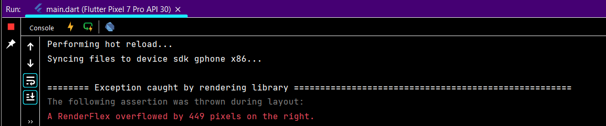
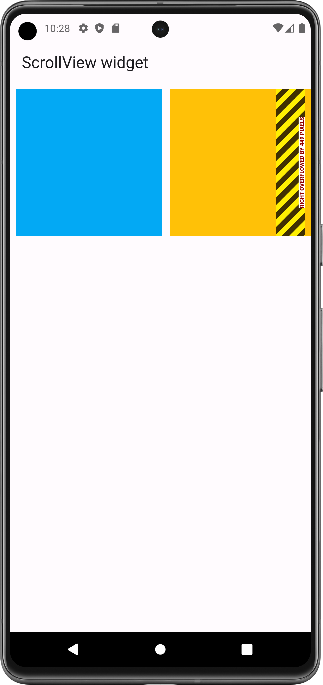
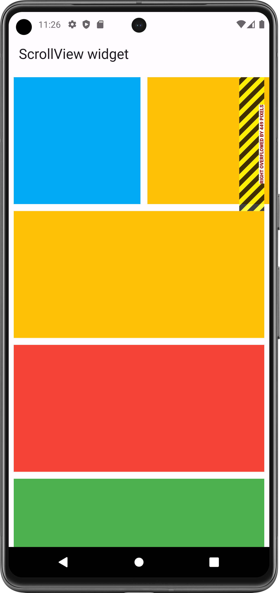
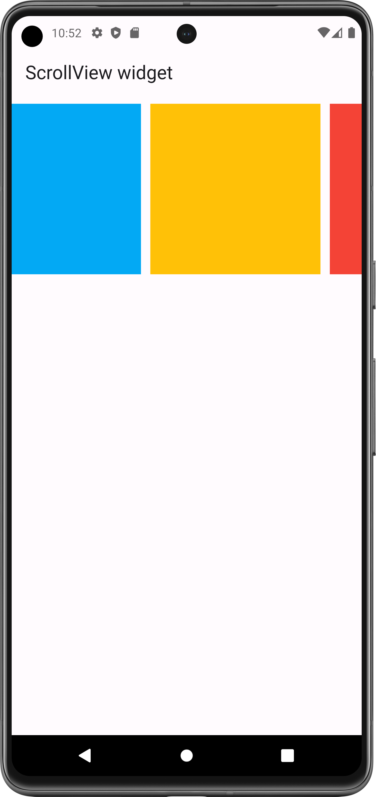
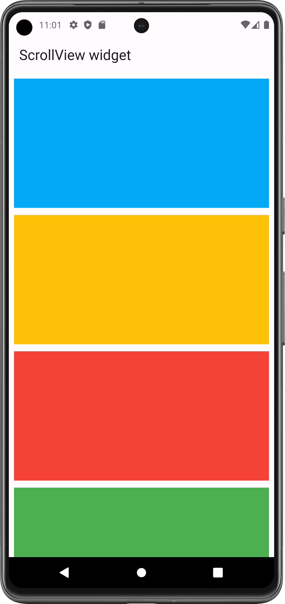
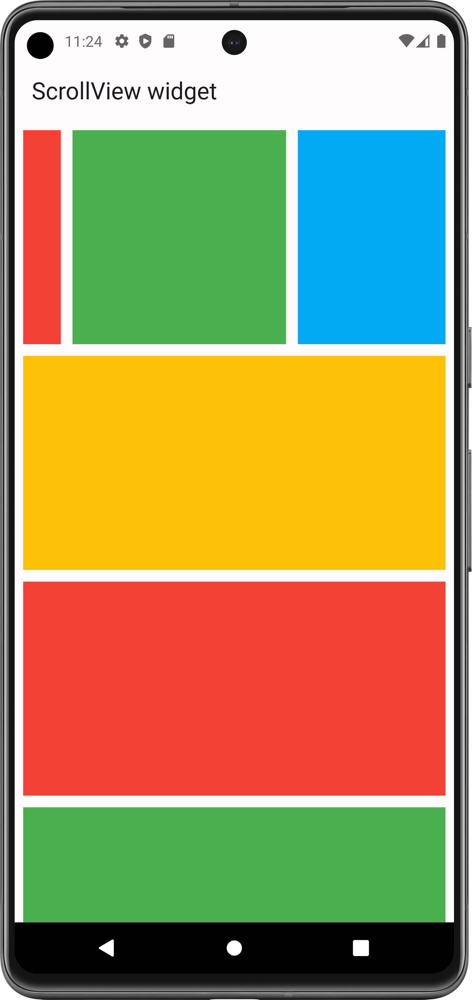

# ScrollView Widget

A box in which a single widget can be scrolled.

Used to make scrollable layout Like row, column, image, combination of widget.

Used to solve RenderFlex overFlow Error

- [Resource(flutter.dev)](https://api.flutter.dev/flutter/widgets/SingleChildScrollView-class.html)

#### Scrolling Views:

<table>
  <tr>
    <td>Row Scrolling</td>
     <td>Column Scrolling</td>
     <td>Scrollable Row&Column </td>
  </tr>
  <tr>
    <td><video src="https://github.com/Jaydip614/Flutter-Development-3.0/assets/148715011/cea9aff0-3b78-4614-9376-f4409337207f
" width=200 height=416></video></td>
    <td><video src="https://github.com/Jaydip614/Flutter-Development-3.0/assets/148715011/0696f177-a025-4d4c-916b-0e9132823dcc" width=200 height=416></video></td>
    <td><video src="https://github.com/Jaydip614/Flutter-Development-3.0/assets/148715011/c407b4f9-587d-4066-b51c-517a553c488d" width=200 height=416></video></td>

  </tr>
 </table>

 # Solve RenderFlex OverFlow Error:

Error: A RenderFlex overflowed by no. of pixels on the right/left/bottom/top.

#### Console:

## Properties:
   - child: any_widget (widget that you want make scrollable)
   - scrollDirection: Axis.(horizontal, vertical)

### RenderFlex overFlow Error:

<table>
  <tr>
    <td>Row overFlowed</td>
     <td>Column overFlowed</td>
     <td>Row in Column </td>
  </tr>
  <tr>
    <td></td>
    <td></td>
    <td></td>

  </tr>
 </table>

### Scrollable Row & Column:

By wrapping with SingleChildScrollView widget, you can make scrollable row and column.
- Note: In Row, you must need to provide Scroll Direction

<table>
  <tr>
    <td>Scrollable Row</td>
     <td>Scrollable Column</td>
     <td>Scrollable Row&Column </td>
  </tr>
  <tr>
    <td></td>
    <td></td>
    <td></td>

  </tr>
 </table>

[//]: #[scroll_row_video.webm](https://github.com/Jaydip614/Flutter-Development-3.0/assets/148715011/cea9aff0-3b78-4614-9376-f4409337207f)

[//]: #[scroll_column_video.webm](https://github.com/Jaydip614/Flutter-Development-3.0/assets/148715011/0696f177-a025-4d4c-916b-0e9132823dcc)

[//]: #[scroll_row_column.webm](https://github.com/Jaydip614/Flutter-Development-3.0/assets/148715011/c407b4f9-587d-4066-b51c-517a553c488d)
