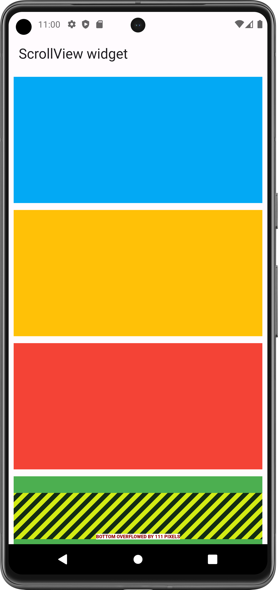

# ScrollView Widget

A box in which a single widget can be scrolled.

Used to make scrollable layout Like row, column, image, combination of widget.

Used to solve RenderFlex overFlow Error

- [Resource(flutter.dev)](https://api.flutter.dev/flutter/widgets/SingleChildScrollView-class.html)

Error: A RenderFlex overflowed by no. of pixels on the right/left/bottom/top.

#### Console:

## Properties:
   - child: any_widget (widget that you want make scrollable)
   - scrollDirection: Axis.(horizontal, vertical)

### RenderFlex overFlow Error:

<table>
  <tr>
    <td>Row overFlowed</td>
     <td>Column overFlowed</td>
     <td>Row in Column </td>
  </tr>
  <tr>
    <td></td>
    <td></td>
    <td></td>

  </tr>
 </table>

### Scrollable Row & Column:

By wrapping with SingleChildScrollView widget, you can make scrollable row and column.
- Note: In Row, you must need to provide Scroll Direction

<table>
  <tr>
    <td>Scrollable Row</td>
     <td>Scrollable Column</td>
     <td>Scrollable Row&Column </td>
  </tr>
  <tr>
    <td></td>
    <td></td>
    <td></td>

  </tr>
 </table>

#### Scrolling Views:

<table>
  <tr>
    <td>Row Scrolling</td>
     <td>Column Scrolling</td>
     <td>Scrollable Row&Column </td>
  </tr>
  <tr>
    <td><video src="video/scroll_row_video.webm" width=250 height=520></video></td>
    <td><video src="video/scroll_column_video.webm" width=250 height=520></video></td>
    <td><video src="video/scroll_row_column.webm" width=250 height=520></video></td>

  </tr>
 </table>

